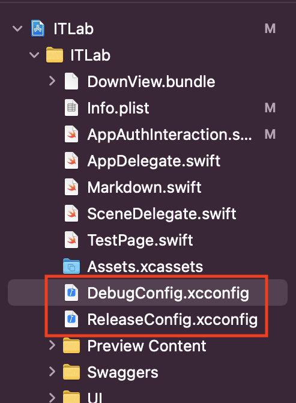
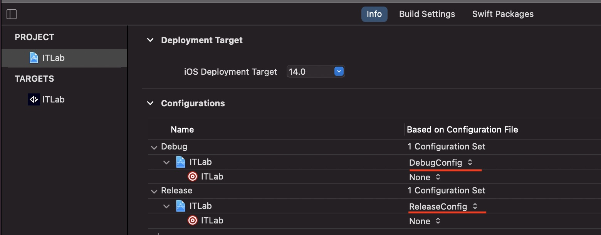

# ITLab - приложение под iOS

## Сборка приложения
Для того, чтобы собрать и запустить приложение, понадобится создать два файла `в папке проекта ITLab/`
1. DebugConfig.xcconfig - конфигурация для Debug версии (работа в симуляторе)
2. ReleaseConfig.xcconfig - конфигурация для Release версии (AppStore)



В данных файлах нужно прописать конфигруацию для подключения к удаленному серверу:

```swift
API_Issuer = ... // Ссылка на сайт

API_isProtocolSecure = ... // Протокол шифрования. true - https, false - http. Сделанно это из за того, что xcconfig распознает двойной / как комментарий

API_Client = ... // Имя клиента в IdentityServer

API_RedirectURL = ... // Ссылка по которой будет происходить перенаправление в IdentityServer
```

После добавление файлов нужно проверить, что конфигруации подключены в проекте в поле `Configuration`



***P.S.** Без этих конфигураций приложение не запуститится*
